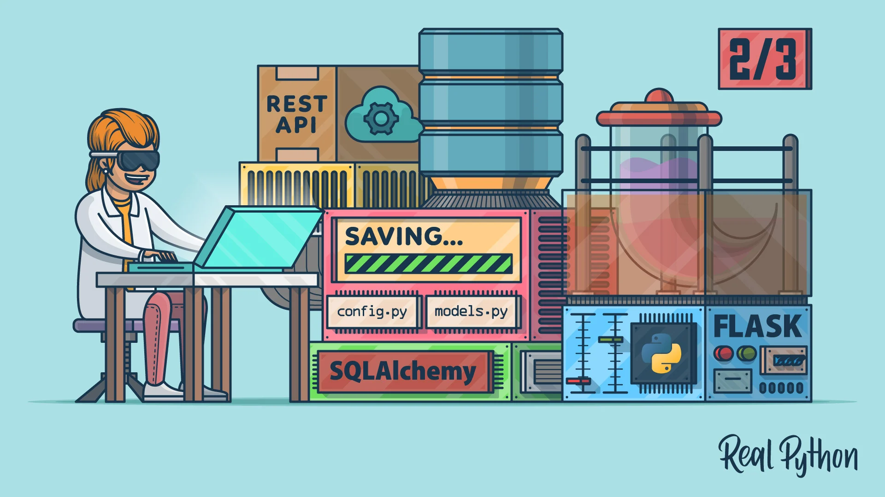
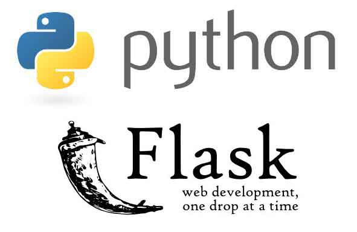
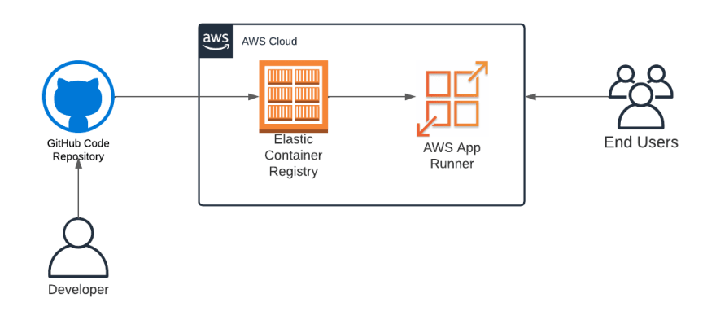

# End to End Machine Learning model deloyment on AWS Apprunner using  Python, Skleran Flask 💵💳

<p align="center">
  
</p>

## 📌 Introduction

As machine learning and AI propagate in software products and services, we need to establish best practices and tools to test, deploy, manage, and monitor ML models in real-world production. In short, with MLOps we strive to avoid “technical debt” in machine learning applications.

SIG MLOps defines “an optimal MLOps experience [as] one where Machine Learning assets are treated consistently with all other software assets within a CI/CD environment. Machine Learning models can be deployed alongside the services that wrap them and the services that consume them as part of a unified release process.” By codifying these practices, we hope to accelerate the adoption of ML/AI in software systems and fast delivery of intelligent software. In the following, we describe a set of important concepts in MLOps such as Iterative-Incremental Development, Automation, Continuous Deployment, Versioning, Testing, Reproducibility, and Monitoring.

## 💵 Dataset Context
The Iris flower data set is a multivariate data set introduced by the British statistician and biologist Ronald Fisher in his 1936 paper The use of multiple measurements in taxonomic problems. It is sometimes called Anderson's Iris data set because Edgar Anderson collected the data to quantify the morphologic variation of Iris flowers of three related species. The data set consists of 50 samples from each of three species of Iris (Iris Setosa, Iris virginica, and Iris versicolor). Four features were measured from each sample: the length and the width of the sepals and petals, in centimeters.

This dataset became a typical test case for many statistical classification techniques in machine learning such as support vector machines

## 💵 Dataset Content
The dataset contains a set of 150 records under 5 attributes - Petal Length, Petal Width, Sepal Length, Sepal width and Class(Species).[Iris Flower Dataset](https://www.kaggle.com/datasets/arshid/iris-flower-dataset)

## 🎯 Purpose of the Project

To bild the end to end machine learning model with three different machine learnign classifiers. So, users can choose the classifier before prediction during seving in the web. And Finally the model deployed on AWS Apprunner service for the production with automatic roll back. In order to that it will deployes the model automatically to the prodcution when the developer pushes the code to the github.

<p align="center">
  
</p>

## 🏁 Classifiers used
* Spport vector machines
* XGBoost Classifiers
* Random Forest Classifiers

This project developed for demo purose. So, did basic EDA and trained the mode with basic model parameters. 

## 🏁 Technology Stack
* [Python](https://python.org/)
* [scikit-learn](https://scikit-learn.org)
* [Flask](https://github.com/pallets/flask)
* [Numpy](https://numpy.org/)
* [Pandas](https://pandas.pydata.org/)
* [Matplotlib: Visualization with Python](https://matplotlib.org/)
* [tqdm](https://github.com/tqdm/tqdm)


## 🏃‍♂️ Local Installation

1. Drop a ⭐ on the Github Repository. 
2. Clone the Repo by going to your local Git Client and pushing in the command: 

```sh
https://github.com/GopalakrishnanSubramani/iris_mlops.git
```
3. Install the Packages: 
```sh
pip install -r requirements.txt
```
You need to install flask seperatly with a latest version to run the flask app in Postman.


## 🎯 Host the web app use Flask your Application

<p align="center">
  
</p>

4. Run the flask app: 
```sh
python ./app.py
```
## 🎯 AWS Apprunner configuration app

<p align="center">
  
</p>


## 🎯 Link for video hosting Flask Application
 ```sh
https://www.linkedin.com/posts/gopalakrishnan-subramani-a0974582_cars-pytorch-flask-activity-7029108228240121856-yIsP?utm_source=share&utm_medium=member_desktop
```

## 📜 LICENSE

[MIT](https://github.com/git/git-scm.com/blob/main/MIT-LICENSE.txt)
    